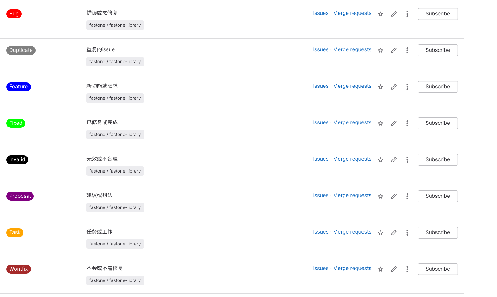

# Gitlab中常见的标签

`Gitlab`中的标签是一个非常有用的功能, 该功能可以帮助我们更好的管理`ISSUE`. 
下面介绍一下`Gitlab`中常见的标签的定义和其使用希望能够对你有所帮助. 

<!--truncate-->

## 标签的定义

下面介绍常见的一些标签的定义, 以便我们更好的使用.

|      名称       |                   颜色                   | 16进制代码  |    描述    |             使用时机              |
|:-------------:|:--------------------------------------:|:-------:|:--------:|:-----------------------------:|
|      Bug      | 红色  | #FF0000 |  错误或需修复  |     当发现或报告一个问题时，可以使用这个标签      |
|   Duplicate   | 灰色  | #808080 | 重复的issue |   当发现或报告一个已经存在的问题时，可以使用这个标签   |
|    Feature    | 蓝色  | #0000FF |  新功能或需求  |   当提出或实现一个新的功能或需求时，可以使用这个标签   |
|     Fixed     | 绿色  | #00FF00 |  已修复或完成  |    当解决或完成一个问题或任务时，可以使用这个标签    |
|    Invalid    | 黑色  | #000000 |  无效或不合理  | 当发现或报告一个不符合规范或逻辑的问题时，可以使用这个标签 |
|   Proposal    | 紫色  | #800080 |  建议或想法   |    当提出或讨论一个建议或想法时，可以使用这个标签    |
|     Task      | 橙色  | #FFA500 |  任务或工作   |    当分配或执行一个任务或工作时，可以使用这个标签    |
|    Wontfix    | 棕色  | #A52A2A | 不会或不需修复  |    当决定不处理或忽略一个问题时，可以使用这个标签    |
|  Improvement  | 粉色  | #FFC0CB |  改进或优化   |  当对一个功能或需求进行改进或优化时，可以使用这个标签   |
|  Enhancement  | 淡蓝色 | #ADD8E6 |  增强或扩展   |  当对一个功能或需求进行增强或扩展时，可以使用这个标签   |
|   Question    | 黄色  | #FFFF00 |  疑问或询问   |   当对一个问题或任务有疑问或询问时，可以使用这个标签   |
|  Help wanted  | 紫红色 | #FF00FF | 需要帮助或协作  |    当需要其他人的帮助或协作时，可以使用这个标签     |
| Documentation | 浅绿色 | #90EE90 | 需要或涉及文档  |   当需要或涉及文档的编写或更新时，可以使用这个标签    |

效果如下:

## 参考资料

- [Labels project management guidelines | GitLab](https://about.gitlab.com/handbook/marketing/project-management-guidelines/labels/)
   这是Gitlab关于标签项目管理指南的页面, 包含了一些创建和使用标签的规范和建议.
- [GitLab Labeling Training | GitLab](https://about.gitlab.com/handbook/support/support-ops/training/gitlab-labeling.html)
   这是Gitlab关于标签培训的页面, 包含了一些标签的最佳实践和示例.